# YouTube Comment Analysis System - Project Documentation

## Project Overview
A real-time YouTube Live Stream Comment Analysis System that monitors live chat messages, analyzes them using AI (LLM), and provides actionable insights including sentiment analysis, trending topics, frequent questions, and moderation suggestions.

---

## 1. LIBRARIES USED

### Backend Libraries

| Library Name | Version | Category | Purpose |
|-------------|---------|----------|---------|
| **Express** | 5.1.0 | Web Framework | Web server framework for building REST APIs and handling HTTP requests |
| **Socket.IO** | 4.8.1 | Real-time Communication | Enables real-time, bidirectional event-based communication between server and clients |
| **Sequelize** | 6.37.7 | ORM | Object-Relational Mapping tool for PostgreSQL database operations |
| **PostgreSQL (pg)** | 8.16.3 | Database Driver | Node.js client library for PostgreSQL database connectivity |
| **Axios** | 1.12.2 | HTTP Client | Promise-based HTTP client for making API requests to YouTube and LLM services |
| **OpenAI** | 6.3.0 | AI/LLM Client | Client library for making LLM API calls (used with OpenRouter) |
| **Google APIs** | 162.0.0 | External API | Official Google API client for YouTube Data API v3 integration |
| **Google Auth Library** | 10.4.0 | Authentication | Google OAuth 2.0 authentication library for user login |
| **JsonWebToken (JWT)** | 9.0.2 | Security | Token-based authentication for API security |
| **Bcryptjs** | 3.0.2 | Security | Password hashing library for secure credential storage |
| **Node-cron** | 4.2.1 | Scheduling | Task scheduler for periodic comment fetching and analysis |
| **Dotenv** | 17.2.3 | Configuration | Environment variable management |
| **CORS** | 2.8.5 | Security | Cross-Origin Resource Sharing middleware |
| **Redis** | 5.8.3 | Caching | In-memory data store for caching and session management |
| **Nodemon** | 3.1.10 | Development | Auto-restart server during development |

### Frontend Libraries

| Library Name | Version | Category | Purpose |
|-------------|---------|----------|---------|
| **React** | 19.2.0 | UI Framework | JavaScript library for building user interfaces |
| **React DOM** | 19.2.0 | UI Rendering | React package for working with the DOM |
| **React Router DOM** | 7.9.4 | Routing | Declarative routing for React applications |
| **Material-UI (MUI)** | 7.3.4 | UI Components | React component library following Material Design |
| **Emotion React** | 11.14.0 | Styling | CSS-in-JS library for styling components |
| **Emotion Styled** | 11.14.1 | Styling | Styled components API for Emotion |
| **Socket.IO Client** | 4.8.1 | Real-time Communication | Client-side library for WebSocket communication |
| **Axios** | 1.12.2 | HTTP Client | Promise-based HTTP client for API requests |
| **React Scripts** | 5.0.1 | Build Tools | Scripts and configuration for Create React App |
| **Testing Library** | Multiple | Testing | Suite for testing React components |
| **Web Vitals** | 2.1.4 | Performance | Library for measuring web performance metrics |

---

## 2. APIs USED

### Internal APIs (Backend REST Endpoints)

| API Endpoint | HTTP Method | Request Format | Response Format | Purpose |
|-------------|-------------|----------------|-----------------|---------|
| **POST /api/auth/google** | GET | None | `{ url: string }` | Get Google OAuth authorization URL |
| **GET /api/auth/google/callback** | GET | Query: `{ code: string }` | Redirect with JWT token | Handle Google OAuth callback and user authentication |
| **POST /api/streams/start** | POST | `{ youtubeUrl: string }` | `{ message: string, stream: Object }` | Start analyzing a YouTube stream |
| **POST /api/streams/:streamId/stop** | POST | Path param: streamId | `{ message: string }` | Stop analysis for a specific stream |
| **GET /api/streams/history** | GET | None | `Array<Stream>` | Retrieve user's stream analysis history |
| **GET /api/health** | GET | None | `"OK"` | Health check endpoint |

### External APIs

| API Name | Provider | Format | Purpose |
|----------|----------|--------|---------|
| **YouTube Data API v3 - Videos** | Google | REST (JSON) | `GET /youtube/v3/videos?part=snippet,liveStreamingDetails&id={videoId}` - Fetch video metadata and live stream details |
| **YouTube Data API v3 - Live Chat Messages** | Google | REST (JSON) | `GET /youtube/v3/liveChat/messages?liveChatId={chatId}` - Fetch live chat messages from ongoing streams |
| **YouTube Data API v3 - Comment Threads** | Google | REST (JSON) | `GET /youtube/v3/commentThreads?videoId={videoId}` - Fetch regular comments from non-live videos |
| **OpenRouter AI API** | OpenRouter | REST (JSON) | `POST /api/v1/chat/completions` - LLM API for comment analysis (uses model: z-ai/glm-4.5-air:free) |

### WebSocket Events (Socket.IO)

| Event Name | Direction | Payload Format | Purpose |
|------------|-----------|----------------|---------|
| **connection** | Bidirectional | `{ socket: Socket }` | Establish WebSocket connection |
| **joinStream** | Client → Server | `{ streamId: string }` | Join a specific stream room for updates |
| **leaveStream** | Client → Server | `{ streamId: string }` | Leave a stream room |
| **newAnalysis** | Server → Client | `{ summary, sentiment, questions, trending, moderation, timestamp, messageCount }` | Push real-time analysis results to clients |
| **streamStatus** | Server → Client | `{ status: string, message: string }` | Notify clients about stream status changes |
| **disconnect** | Bidirectional | None | Handle client disconnection |

---

## 3. SYSTEM ARCHITECTURE (PlantUML)

```plantuml
@startuml YouTube Comment Analysis System Architecture

!define RECTANGLE class

' Actors
actor User as user
actor "Google OAuth" as google
actor "YouTube API" as youtube
actor "OpenRouter LLM" as llm

' Components
rectangle "Frontend (React)" as frontend {
  component "Login Component" as login
  component "Stream Input" as input
  component "Analysis Dashboard" as dashboard
  component "Auth Context" as authctx
  component "Stream Context" as streamctx
  component "Socket.IO Client" as socketclient
}

rectangle "Backend (Node.js/Express)" as backend {
  component "Express Server" as server
  component "Socket.IO Server" as socketserver
  component "Auth Controller" as authcontroller
  component "Stream Controller" as streamcontroller
  component "Auth Middleware" as authmiddleware
  component "Error Handler" as errorhandler
}

rectangle "Services Layer" as services {
  component "YouTube Service" as youtubeservice
  component "LLM Service" as llmservice
  component "Scheduler Service" as schedulerservice
}

rectangle "Data Layer" as data {
  database "PostgreSQL" as db
  component "User Model" as usermodel
  component "Stream Model" as streammodel
  component "Analysis Model" as analysismodel
  component "Sequelize ORM" as sequelize
}

rectangle "External Services" as external {
  component "Node-Cron" as cron
  component "Redis Cache" as redis
}

' Relationships - User Flow
user --> login : 1. Access Login Page
login --> google : 2. OAuth Request
google --> authcontroller : 3. OAuth Callback
authcontroller --> usermodel : 4. Create/Find User
authcontroller --> user : 5. JWT Token

user --> input : 6. Enter YouTube URL
input --> streamctx : 7. Start Analysis
streamctx --> socketclient : 8. Connect WebSocket
streamctx --> streamcontroller : 9. POST /streams/start

streamcontroller --> authmiddleware : 10. Verify JWT
authmiddleware --> streamcontroller : 11. Authorized
streamcontroller --> youtubeservice : 12. Fetch Video Details
youtubeservice --> youtube : 13. API Call
youtube --> youtubeservice : 14. Video Metadata
streamcontroller --> streammodel : 15. Save Stream
streamcontroller --> schedulerservice : 16. Start Scheduler

schedulerservice --> cron : 17. Schedule Task
cron --> schedulerservice : 18. Trigger (1-5 min)
schedulerservice --> youtubeservice : 19. Fetch Comments
youtubeservice --> youtube : 20. Get Live Chat/Comments
youtube --> youtubeservice : 21. Comment Data

youtubeservice --> schedulerservice : 22. Return Messages
schedulerservice --> llmservice : 23. Analyze Comments
llmservice --> llm : 24. LLM API Call
llm --> llmservice : 25. Analysis Result
llmservice --> schedulerservice : 26. Parsed Analysis

schedulerservice --> analysismodel : 27. Save Analysis
schedulerservice --> socketserver : 28. Emit newAnalysis
socketserver --> socketclient : 29. Real-time Update
socketclient --> streamctx : 30. Update State
streamctx --> dashboard : 31. Render Results
dashboard --> user : 32. Display Analysis

' Data Flow
sequelize --> db : ORM Operations
usermodel --> sequelize
streammodel --> sequelize
analysismodel --> sequelize

' Error Handling
streamcontroller --> errorhandler : On Error
youtubeservice --> schedulerservice : Fallback on API Error
llmservice --> schedulerservice : Heuristic Fallback

' Notes
note right of schedulerservice
  Runs every 1 min (live streams)
  or 5 min (regular videos)
end note

note right of llmservice
  5 Analysis Types:
  - Chat Summarization
  - Sentiment Analysis
  - Frequent Questions
  - Moderation Suggestions
  - Trending Topics
end note

note right of socketserver
  Real-time bidirectional
  communication for live updates
end note

@enduml
```



---

## 4. PROGRAM CODING & IMPLEMENTATION

### 4.1 System Workflow

#### **Phase 1: User Authentication**
1. User accesses the application
2. Frontend displays login page with Google OAuth option
3. User clicks "Start Analyzing" (currently bypassed for testing)
4. Backend creates/retrieves user from PostgreSQL database
5. JWT token generated and returned to frontend
6. Token stored in localStorage for session management

#### **Phase 2: Stream Initialization**
1. User enters YouTube URL in the input field
2. Frontend validates URL format and extracts video ID using regex
3. POST request sent to `/api/streams/start` with YouTube URL
4. Backend validates JWT token via auth middleware
5. YouTube Service calls YouTube Data API v3 to fetch:
   - Video title and channel name
   - Live streaming status (isLive)
   - Live chat ID (if live stream)
6. Stream record created in PostgreSQL database with status `isActive: true`

#### **Phase 3: Scheduler Service Activation**
1. Scheduler Service receives stream ID
2. Creates cron job based on stream type:
   - **Live streams**: Every 1 minute (`*/1 * * * *`)
   - **Regular videos**: Every 5 minutes (`*/5 * * * *`)
3. Immediate first analysis cycle triggered
4. Cron job stored in activeJobs Map for lifecycle management

#### **Phase 4: Comment Fetching (Recurring)**
1. Cron job triggers analysis cycle at scheduled interval
2. YouTube Service fetches comments based on stream type:
   - **Live streams**: Uses `liveChatMessages` endpoint with liveChatId
   - **Regular videos**: Uses `commentThreads` endpoint with videoId
3. Pagination handled using `pageToken` (stored as `lastFetchedCommentId`)
4. Returns array of message objects: `{ id, text, author, timestamp }`
5. Maximum 200 messages per fetch (live) or 100 (regular)

#### **Phase 5: LLM Analysis**
1. Messages passed to LLM Service with stream metadata
2. **Rate limiting**: LLM calls limited to once per minute per stream
3. **Single API call** to OpenRouter with comprehensive prompt requesting:
   - **Summary**: 4-5 sentence narrative of conversations
   - **Sentiment**: Overall sentiment + distribution (positive/neutral/negative)
   - **Questions**: Most frequently asked questions with themes
   - **Moderation**: Poll suggestions, spam alerts, engagement tips
   - **Trending**: Top topics and keywords by mention count
4. **Response format**: Structured JSON matching predefined schema
5. **Retry mechanism**: 3 attempts with exponential backoff
6. **Fallback system**: If LLM fails, heuristic analysis used:
   - Word frequency analysis with stop-word filtering
   - Simple sentiment calculation using positive/negative keyword lists
   - Question extraction using `?` detection
   - Basic trending topic identification

#### **Phase 6: Data Storage & Broadcasting**
1. Analysis results saved to PostgreSQL `Analysis` table:
   - Type: `summary`, `sentiment`, `questions`, `moderation`, `trending`
   - Data: JSONB field storing analysis object
   - Linked to stream via foreign key
2. Socket.IO emits `newAnalysis` event to stream-specific room
3. All connected clients in the room receive real-time update
4. Frontend merges new data with existing state (prevents UI regression)

#### **Phase 7: Real-time Frontend Updates**
1. Socket.IO client receives `newAnalysis` event
2. Stream Context updates `analysisData` state
3. Analysis Dashboard re-renders with new data:
   - **Summary Card**: Shows narrative, key themes, engagement level
   - **Sentiment Card**: Progress bars for positive/neutral/negative distribution
   - **Questions Card**: List of frequent questions with count and theme
   - **Trending Card**: Bubble tags showing trending topics with mention counts
4. State persistence ensures previously loaded sections remain visible

#### **Phase 8: Stream Termination**
1. User clicks "Stop Analysis" button
2. Frontend calls POST `/api/streams/:streamId/stop`
3. Scheduler Service stops cron job and removes from activeJobs Map
4. Stream record updated: `isActive: false`
5. Socket.IO emits `streamStatus` with status: `stopped`
6. Frontend disconnects from stream room
7. UI returns to idle state

### 4.2 Key Technical Features

#### **Error Handling Strategy**
- Try-catch blocks at every async operation
- Graceful degradation: LLM failures → heuristic fallbacks
- YouTube API errors → empty message arrays (prevents crash)
- Socket.IO automatic reconnection
- Global error handler middleware catches unhandled errors

#### **Performance Optimizations**
- **Rate limiting**: LLM calls throttled to 1/minute per stream
- **Pagination**: Efficient comment fetching with pageToken
- **Lazy initialization**: OpenRouter client created on-demand
- **Database indexing**: Unique constraints on `youtubeVideoId` and `googleId`
- **State merging**: Frontend prevents unnecessary re-renders

#### **Security Measures**
- JWT-based authentication for all protected routes
- CORS configured for specific frontend origin
- Environment variables for sensitive credentials
- bcryptjs for password hashing (if manual auth added)
- SQL injection prevention via Sequelize ORM

#### **Scalability Considerations**
- Socket.IO rooms isolate stream-specific updates
- Active jobs managed in Map for O(1) lookup
- Redis available for distributed caching (configured but not fully utilized)
- Sequelize supports connection pooling
- Stateless server design allows horizontal scaling

---

## 5. RESULTS & OUTPUTS

### 5.1 Analysis Output Examples

#### **Summary Output**
```json
{
  "summary": "Viewers are enthusiastically discussing the new game update, with several people asking about hardware requirements. John and Sarah are debating the best build strategy while others share their excitement with emoji reactions. The chat shows high energy with frequent questions about upcoming features.",
  "key_themes": ["Game Update", "Hardware", "Strategy", "Features"],
  "engagement_level": "high",
  "viewer_sentiment": "positive",
  "word_count": 156,
  "notable_moments": [
    "[John] What graphics card do you recommend?",
    "[Sarah] This update is amazing!",
    "[Mike] Can't wait for the next stream!"
  ]
}
```

#### **Sentiment Analysis Output**
```json
{
  "overall_sentiment": "positive",
  "distribution": {
    "positive": 0.65,
    "neutral": 0.28,
    "negative": 0.07
  },
  "negative_words": ["bad", "annoyed", "boring"],
  "summary": "The chat sentiment is largely positive, with viewers expressing excitement and engagement."
}
```

#### **Frequent Questions Output**
```json
{
  "frequent_questions": [
    {
      "question": "What graphics card do you use?",
      "count": 15,
      "theme": "Hardware"
    },
    {
      "question": "Will this run on my PC?",
      "count": 10,
      "theme": "Compatibility"
    },
    {
      "question": "When is the next update?",
      "count": 8,
      "theme": "Updates"
    }
  ]
}
```

#### **Trending Topics Output**
```json
{
  "trending_topics": [
    {
      "topic": "New Update",
      "mentions": 45,
      "keywords": ["update", "patch", "new", "release"]
    },
    {
      "topic": "RTX Graphics",
      "mentions": 32,
      "keywords": ["rtx", "graphics", "gpu", "nvidia"]
    },
    {
      "topic": "Gameplay Strategy",
      "mentions": 28,
      "keywords": ["strategy", "build", "guide", "tips"]
    }
  ]
}
```

#### **Moderation Suggestions Output**
```json
{
  "poll_suggestions": [
    {
      "question": "What content should we cover next?",
      "options": ["Hardware reviews", "Game tutorials", "Live gameplay"]
    }
  ],
  "moderation_alerts": [
    "User 'spam_bot' is sending repetitive links.",
    "High volume of questions about GPU - consider addressing."
  ],
  "engagement_suggestions": [
    "Many viewers are asking about your setup. Consider doing a quick tour.",
    "The chat is excited about the new update. Spend more time discussing it.",
    "Several questions about hardware compatibility - create a FAQ section."
  ]
}
```

### 5.2 Frontend UI Components

#### **Dashboard Visualization**
- **Summary Card**: White card with blue accent, displays narrative text and theme tags
- **Sentiment Card**: Visual progress bars (green/blue/red) showing distribution percentages
- **Negative Words Alert**: Red-tinted box displaying flagged negative words as pills
- **Questions List**: Bulleted list with question text, count, and theme metadata
- **Trending Topics**: Blue bubble tags with topic name and mention count
- **Real-time Updates**: Smooth state transitions without placeholder regression

### 5.3 System Performance Metrics

| Metric | Value | Description |
|--------|-------|-------------|
| **Comment Fetch Interval** | 1 min (live) / 5 min (regular) | Frequency of YouTube API calls |
| **LLM Analysis Rate** | 1 call/min per stream | Rate limiting for cost optimization |
| **Max Comments per Fetch** | 200 (live) / 100 (regular) | YouTube API limits |
| **WebSocket Latency** | < 100ms | Real-time update delivery time |
| **LLM Response Time** | 2-5 seconds | Average API response time |
| **Database Query Time** | < 50ms | Sequelize ORM query performance |
| **Retry Attempts** | 3 attempts | LLM call retry limit |
| **Backoff Time** | 1s, 2s, 3s | Exponential backoff between retries |

### 5.4 Data Models

#### **User Model**
- `googleId`: Unique Google account identifier
- `email`: User email address
- `name`: User display name
- `picture`: Profile picture URL

#### **Stream Model**
- `youtubeVideoId`: 11-character YouTube video ID
- `title`: Video title
- `channelTitle`: Channel name
- `isActive`: Current analysis status
- `liveChatId`: Live chat identifier (null for non-live)
- `isLive`: Boolean flag for live stream detection
- `lastFetchedCommentId`: Pagination token for next fetch
- `UserId`: Foreign key to User model

#### **Analysis Model**
- `type`: Enum (`summary`, `sentiment`, `questions`, `moderation`, `trending`)
- `data`: JSONB field storing analysis results
- `StreamId`: Foreign key to Stream model
- `createdAt`: Timestamp for historical tracking

---

## 6. PROJECT STRUCTURE

```
youtubeCOMMENTanalysis/
├── backend/
│   ├── src/
│   │   ├── config/
│   │   │   ├── database.js          # PostgreSQL Sequelize configuration
│   │   │   └── openRouter.js        # OpenRouter LLM client setup
│   │   ├── controllers/
│   │   │   ├── authController.js    # Google OAuth logic
│   │   │   └── streamController.js  # Stream CRUD operations
│   │   ├── middleware/
│   │   │   ├── auth.js              # JWT authentication middleware
│   │   │   └── errorHandler.js      # Global error handler
│   │   ├── models/
│   │   │   ├── User.js              # User schema
│   │   │   ├── Stream.js            # Stream schema
│   │   │   ├── Analysis.js          # Analysis schema
│   │   │   └── index.js             # Model exports
│   │   ├── routes/
│   │   │   ├── auth.js              # Authentication routes
│   │   │   └── streams.js           # Stream management routes
│   │   ├── services/
│   │   │   ├── youtubeService.js    # YouTube API integration
│   │   │   ├── llmService.js        # LLM analysis logic
│   │   │   └── schedulerService.js  # Cron job management
│   │   ├── utils/
│   │   │   ├── logger.js            # Custom logging utility
│   │   │   └── socket.js            # Socket.IO instance holder
│   │   └── server.js                # Express server entry point
│   ├── package.json                 # Backend dependencies
│   └── .env                         # Environment variables
├── frontend/
│   ├── src/
│   │   ├── components/
│   │   │   ├── Login.js             # Login page
│   │   │   ├── Layout.js            # App layout with header
│   │   │   ├── StreamInput.js       # URL input component
│   │   │   ├── AnalysisDashboard.js # Results visualization
│   │   │   └── ProtectedRoute.js    # Auth guard component
│   │   ├── context/
│   │   │   ├── AuthContext.js       # Authentication state management
│   │   │   └── StreamContext.js     # Stream & analysis state
│   │   ├── services/
│   │   │   ├── api.js               # Axios HTTP client
│   │   │   └── authService.js       # Token management
│   │   ├── App.js                   # Main React component
│   │   └── index.js                 # React DOM entry point
│   ├── public/
│   │   └── index.html               # HTML template
│   └── package.json                 # Frontend dependencies
└── README.md                        # Project README

```

---

## 7. ENVIRONMENT CONFIGURATION

### Required Environment Variables

**Backend (.env)**
```env
# Server
PORT=3001
FRONTEND_URL=http://localhost:3000

# Database
DB_NAME=youtube_analysis
DB_USER=postgres
DB_PASS=yourpassword
DB_HOST=localhost

# Authentication
JWT_SECRET=your_jwt_secret_key
GOOGLE_CLIENT_ID=your_google_client_id
GOOGLE_CLIENT_SECRET=your_google_client_secret

# YouTube API
YOUTUBE_API_KEY=your_youtube_api_key

# LLM Service
OPENROUTER_API_KEY=your_openrouter_api_key
OPENROUTER_BASE_URL=https://openrouter.ai/api/v1
OPENROUTER_MODEL=z-ai/glm-4.5-air:free

# Redis (Optional)
REDIS_URL=redis://localhost:6379
```

**Frontend (.env)**
```env
REACT_APP_API_URL=http://localhost:3001
```

---

## 8. DEPLOYMENT INSTRUCTIONS

### Backend Deployment
1. Install PostgreSQL and create database
2. Install Node.js (v18+)
3. Clone repository and navigate to `backend/`
4. Run `npm install`
5. Create `.env` file with required variables
6. Run `npm start` to start server on port 3001

### Frontend Deployment
1. Navigate to `frontend/`
2. Run `npm install`
3. Create `.env` file with API URL
4. Run `npm start` to start development server on port 3000
5. For production: `npm run build` and serve build folder

---

## 9. TESTING APPROACH

### Manual Testing Workflow
1. Start backend server (`npm start` in backend/)
2. Start frontend server (`npm start` in frontend/)
3. Access http://localhost:3000
4. Click "Start Analyzing"
5. Enter YouTube URL: https://www.youtube.com/watch?v=VIDEO_ID
6. Click "Start Analysis"
7. Observe real-time updates in Analysis Dashboard
8. Verify summary, sentiment, questions, and trending topics
9. Click "Stop Analysis" to terminate

### Test Cases
- ✅ Live stream with active chat
- ✅ Regular video with existing comments
- ✅ Invalid YouTube URL handling
- ✅ Network error recovery (YouTube API timeout)
- ✅ LLM failure → heuristic fallback
- ✅ Real-time updates via WebSocket
- ✅ Multiple concurrent streams (different users)
- ✅ Stop/restart analysis for same stream

---

## 10. FUTURE ENHANCEMENTS

1. **Advanced Analytics**: Historical trend analysis, word clouds, engagement graphs
2. **Export Features**: PDF reports, CSV data export
3. **Multi-language Support**: Analyze comments in multiple languages
4. **Enhanced Moderation**: Toxicity detection, automated content filtering
5. **Notifications**: Email/SMS alerts for specific keywords or sentiment shifts
6. **Dashboard Customization**: User-configurable widgets and themes
7. **API Rate Limiting**: Implement Redis-based rate limiting
8. **Horizontal Scaling**: Redis Pub/Sub for multi-instance Socket.IO
9. **Premium Features**: Advanced LLM models, higher rate limits
10. **Mobile App**: React Native mobile application

---

## 11. ACKNOWLEDGMENTS & REFERENCES

### Technologies Used
- **Node.js & Express**: Backend server framework
- **React**: Frontend UI library
- **Socket.IO**: Real-time communication
- **PostgreSQL**: Relational database
- **Sequelize**: ORM for database operations
- **OpenRouter**: LLM API aggregator
- **YouTube Data API v3**: Comment and video data source
- **Google OAuth**: User authentication

### API Documentation
- [YouTube Data API](https://developers.google.com/youtube/v3)
- [OpenRouter API](https://openrouter.ai/docs)
- [Socket.IO Documentation](https://socket.io/docs)
- [Sequelize ORM](https://sequelize.org/docs)

---

**Project Prepared By:** [Your Name]  
**Date:** November 1, 2025  
**Institution:** [Your Institution]  
**Course:** [Course Name]  
**Instructor:** [Professor Name]

---

*This documentation provides a complete overview of the YouTube Comment Analysis System architecture, implementation, and results for academic project submission.*

